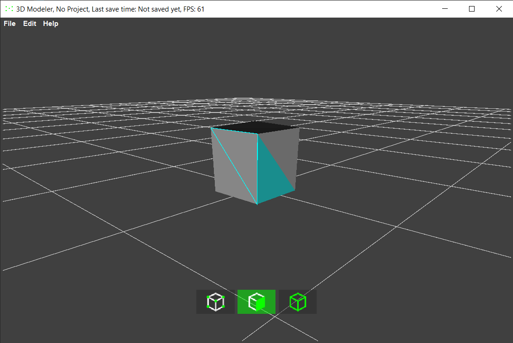
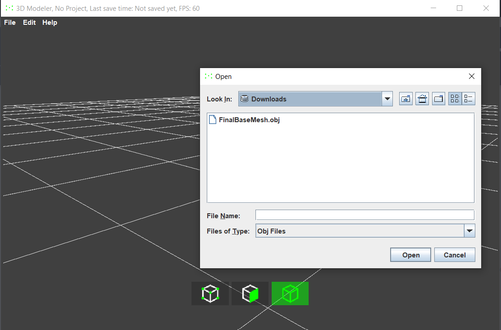
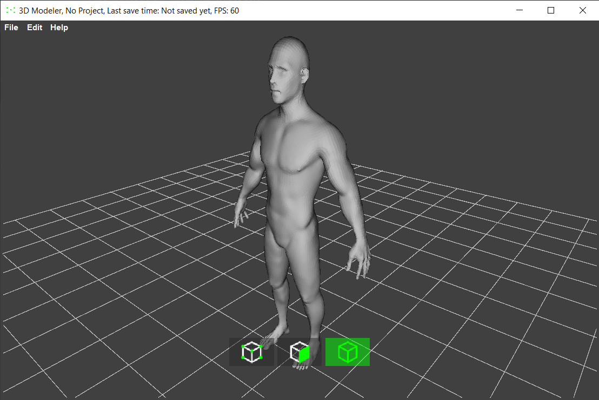

# 3D Modeler - Java Swing 3D Engine

This project is a **3D modeling software** built entirely in **Java Swing**.  
It allows you to create, view, and manipulate 3D models, similar to basic features of Blender.

---

## Features
- Pure **Java Swing** UI (no external graphics libraries).
- **Custom 3D engine**: rendering pipeline, shading, transformations.
- **Import / Export** of 3D models.
- **Grid & Camera controls** for navigation.
- Supports obj files.

---

## Screenshots

|  |  |  |
|----------------------------------------|----------------------------------------|----------------------------------------|
| 3D viewport                            | UI with menus and tools                | Import and edit modles                  |

